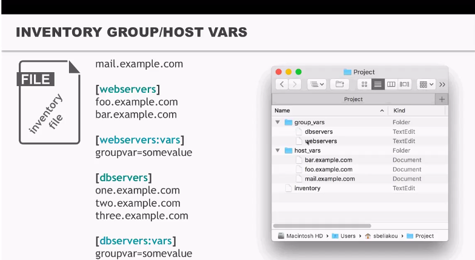

 ### Inventory patterns:
 
***All*** 
 ```
 - hosts: all
 - hosts: *
 ```
 ***Wildcard*** 
 ```
 - hosts: ~(web|db).*\.example\.com
 ```
  ***AND*** 
  
 Run playbook on both hosts:
 ```
 - hosts: one.example.com:two.example.com
 ```
 Run playbook on hosts of both groups:
 ```
 - hosts: webservers:dbservers
 ```
 Run on host and group:
 ```
 - hosts: one.example.com:dbservers
```
 Wildcard:
```
 - hosts: one*.com:dbservers
```
 
 ***Exclude*** 
 
Run on all hosts of group exclude 1 host:
```
 - hosts: webservers:!phoenix
```
Run on all hosts exclude 1 group:
```
 - hosts: all:!dbservers
 ```
 ***Intersection*** 
 
Run only on hosts wich are in first group and in second group simultaneously:
```
 - hosts: webservers:&staging
```
So the common rule is:
```
webservers:{{extended}}:!{{excluded}}:&{{required}}
```

We can call host next way:
```
 - hosts: webservers[0]
 - hosts: webservers[-1]
 - hosts: webservers[0:2]
```

 Also is available such inventory option:

